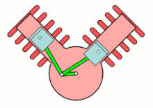

[<<terug naar overzicht](readme.html)  
[<<terug naar overzicht .md](readme.md)
#Projectgegevens
Projectpartner: Motoren Revisie Meijerink, http://mrmbv.nl/NL/  
Contactpersoon: ..Hans Meijerink... mrmbv1@planet.nl 

Betrokken:  
- Erik Goselink  
- Ivo Vrooijnk  
- Paul Groneveld  

# Inleiding
Deze uitwerking gaat over het hermaterialiseren van een zuiger van een verbrandingsmotor gebaseerd op Additive Manucaturing productieprocessen (3d-printen). In H1 wordt het bestaande product; de zuiger geanalyseerd. In H2 wordt besproken met welke intentie het nieuwe product op de markt wordt gezet en welke productuitstraling daarbij hoort. In H3 worden verschillende productieprocessen, conventioneel en AM, bestudeerd om ideeën te genereren voor de hermaterialisatie. In H4 worden verschillende mogelijkheden vanuit Productieprocessen en materiaal combinaties als idee neergezet, waarna deze in H5 verder worden uitgewerkt om de mogelijkheden van de verschillende varianten met elkaar te kunnen vergelijken. Als laatste wordt in H6 een Munlti criteria analyse opgesteld waarmee verschillende hermaterialisatieconcepten met elkaar vergeleken kunnen worden. In overleg met de projectpartner kan op deze manier een keuze worden gemaakt voor de verdere uitvoering, met als doel; het economisch gunstig produceren van zuigers op basis van Additive Manufacturing. 

#H1: Analyse van bestaand concept: de zuiger

De **Intentie** (I) waarmee zuigers gemaakt worden:
Wereldwijd zijn er, op basis van een eenvoudige inschatting 20 miljard+ zuigers dagelijks in gebruik. Deze worden gebruikt in verbrandingsmotoren om een verticale beweging in een cilinder tot stand te brengen. Deze beweging en kracht wordt over gezet op de drijfstang en deze zet vervolgens de krukas in een ronddraaiende beweging.

Onder normale omstandigheden gaat een zuiger langer mee dan het gebruik van bijvoorbeeld een auto. Bij klassieke auto's is het gebruikelijk om de motor te reviseren en daarbij worden de zuigers ook vervangen. Het kan voorkomen dat de zuigers niet meer commercieel leverbaar zijn, omdat ze gewoonweg niet meer leverbaar zijn of te duur zijn. In deze gevallen is het mogelijk om zuigers te laten namaken. Omdat dit een arbeidsintensief proces is, gebeurt dit vaak in lageloonlanden. 

Het concept met de nodige functionaliteit is vastgesteld in de bestaande uitwerking. De vorm wordt nu onderzocht op functies die nodig zijn voor een goede werking van de zuiger.

In de onderstaande afbeelding staat een zuiger van een .... weergegeven. Het is de wens van de projectpartner Motoren Revisie Meijerink om deze zuiger op basis van Additief Manufacturing te kunnen maken op een concurrerende manier in lage aantallen (tientallen per keer).

  

**Productuitstraling (EP):**
De bestaande zuiger is een hogedruk  aluminium spuitgietonderdeel. Dit wordt vooral duidelijk door de details aan de binnenkant van het product. Daar zitten ribben en typische details uit een spuitgietproces. De buitenkant is glad nabewerkt met verspaning en slijptechnieken.
Gewicht is ook een indicatie voor de kwaliteit van de zuiger en de prestatie.
De verbindingsvormen zijn machinaal bewerkt en hebben nauwkeurig toleranties. Ze zien e glad en glimmend uit.

**Shaping P1**
Hogedruk spuitgieten in een stalen mal.

Er worden in de mal stalen inserts geplaatst. Functie is nu niet geheel duidelijk. Waarschijnlijk een verstijving / versterking van de vorm. Mogelijk ook minder uitzetting? Of een stabielere vorm bij hogere temperaturen.

Na het gieten Wordt de aanspuittak verwijdert. Plaats van de aanspuiting is nu nog niet duidelijk. 

Een zuiger kan gemaakt worden met het zwaartekreachtgietproces voor aluminium. Daarbij kan gewerkt worden met een 5 delige matrijs. De onderkant wordt gevormd door 3 delen en de bovenkant wordt gevormd door 2 delen. Langs de zij

**Joining P2**
De hoofdvorm van de cilinder is interessant, want deze verbindingsvorm moet conisch zijn ivm het temperatuurverloop tijdens gebruik. Bovenaan zet de zuiger meer uit dan onderaan. Verder is de vorm niet cilindrisch, maar elliptisch. Dit wordt gedaan om te voorkomen dat de zuiger vast komt te zitten in de cilinder. De zuiger kan vanuit een elliptische vorm altijd nog iets buigen en loopt daardoor niet vast in de cilinderwand. 

De zuiger heeft twee uitstekende "tongen", deze hebben als functie het voorkomen van kantelen en daardoor is er minder slijtage tijdens gebruik. 

Op de plaats van de olieschrapen en de zuigerveer, wordt het onderdeel verspanend nabewerkt op een draaibank, om zo een nauwkeurige groef te kunnen maken.

De twee gaten voor de drijfstangbus, worden verspanend nabewerkt en er wordt een groef voor de c-clip gestoken aan beide kanten.

Aan de binnekant is de zien dat er (zeer waarschijnlijk) twee stalen inserts met gaten in de matrijs worden gelegd. De gaten zijn de verbindingsvorm ten opzichte van het aluminium. (dit is nog niet echt duidelijk).

**Surface treatment P3**
Het oppervlakte aan de buitenkant wordt nauwkeurig nabewerkt en op de kop mogelijk geschuurd. 

Er wordt een warmtebehandeling toegepast op het hele onderdeel. 

**Constructie**
  
De vormbeschrijving van de binnenkant van een zuiger is gedetailleerd en wordt vaak door de matrijs bepaald (3 delen). De buitenkant wordt vaak met een offset geproduceerd zodat deze kan worden nabewerkt. Ook is een grotere wanddikte gunstig bij het vullen van de mal. Het materiaal stolt dan minder snel.

In de onderstaande afbeelding worden details van de zuiger weergegeven. Deze worden vervolgend in de tekst verder besproken per nummer.  

  
1. Wat is de functie van het kleine schuine gaatje? *Antwoord*: Er zitten twee stalen gebogen platen ingegoten aan de binnenkant van de zuiger. De functie van deze insert is zeer waarschijnlijk het verstijven van het onderdeel. Aluminium zuigers moeten met een grotere passingsmaat werken, omdat aluminium meer uitzet dan staal. Mogelijk wordt de insert ook gebruikt om de uitzetting tegen te gaan (lijkt wel moeilijk). 

2. De twee platte ringen, zijn dat olieschrapers? *Antwoord*: Ja dit zijn olieschrapers.  

3. Wat doet de geperforeerde ringband tussen de olieschrapers? *Antwoord*: Dit onderdeel zorgt ervoor dat de olie rondom geschraapt en afgevoerd kan worden.

4. Er zijn twee sleuven aangebracht, ter hoogte van de olieschrapers en de geperforeerde ringband, wat is de functie van deze opening? Is nogal een grote opening, mechanische een verzwakking. *Antwoord*: De sleuven zijn ervoor om de geschraapte olie, vanuit de cilinderwand naar de binnenkant van de zuiger te transporteren.

5. Aan de onderkant van de zuiger zitten twee uitstekende "tongen". Wat is de functie van deze tongen? *Antwoord*: De tongen aan de onderkant zijn bedoeld om de zuiger extra stabiel te krijgen mbt kantelen in de cilinder. Tegenwoordig kunnen zuigers lager zijn, maar voor dit project is de huidige hoogte van toepassing.

6. De holle ruimte aan de binnenkant van de zuiger, heeft deze ruimte een functie, bijvoorbeeld mbt compressie en stromingen? Of mag deze ruimte met uitzondering van de ruimte die nodig is voor de beweging van de krukas, gevuld worden met materiaal? *Antwoord*: De ruimte aan de binnenkant van de zuiger is op zich niet functioneel mbt de luchtstroming in de motor. Echter, wil de opdrachtgever geen vormen die afwijken van het origineel. Dat betekent dat de gehele vormbeschrijving eigenlijk vaststaat. Aan de binnenkant van de zuiger kunnen details, zoals ribben en afrondingen wel enigszins afwijken. 

7. Aan de binnenkant van de onderrand, zitten twee lage ribben. Heeft dit alleen een mechanische functie? *Antwoord*: Ja dit is bedoeld voor verstijving van de vorm.

**Materiaal**  
Om vast te stellen welk materiaal gebruikt is voor het maken van de bestaande zuiger kunnen we:  
1. de leverancier vragen, via de projectpartner  
2. materiaal onderzoek doen, in materialenlab SAXION  
3. een schatting doen vanuit CES-edupack

Optie 3 is hieronder weergegeven.  
Het materiaal dat nu gebruikt zou kunnen zijn is: ...  
[Datasheet downloaden](project1_zuiger\materiaal\aluminium_336.pdf)  

#H2 Nieuwe Intentie en Productuitstraling  
Over de productuitstraling voor het nieuwe product, kunnen we het kort houden. Het is duidelijk de bedoeling dat de koper / monteur / gebruiker van het product het onderdeel als gelijk ervaart ten opzicht van het bestaande product. Dat betekent dat de beschrijving van de hoofdvorm optisch gelijk zal moeten worden en het gewicht van het product moet ook gelijk blijven. Dit betekent niet perse dat het materiaal ook het zelfde moet blijven. 

De eisen die aan het product geste;d worden zijn:  
1 Moet zoveel mogelijk op het origineel lijken  
3 Moet aan de buitenkant een zuivere kopie zijn  
4 Mag aan de binnenkant op details een beetje afwijken  
5 Moet taps afnemen, ivm warmteverschil (maten afhankelijk van speling en uitzetting)  
6 Moet ovaal zijn, ivm het voorkomen van klemming in cilinder  
7 Moet vergelijkbaar gewicht hebben, met een maximael afwijking van …..  
8 Verbindingsvormen moeten identiek zijn  
9 Nabewerking waar nodig, near net shape  
10 Stalen inserts: " wangen", functie acherhalen en compenseren in nieuwe vorm  
11 Maximale druk 24 bar?
12 Geschikt zijn voor wisselbelastingen  

**Design for X**
Waar moet het product erg goed in zijn? De X staat hier voor design for Additive Manufacturing en minimale kosten bij lokale productie. Het proces moet zo geschikt mogelijk zijn voor flexibel produceren: series van enkele stuks en tientallen met variatie in vormen.   

#H3 Proces en materiaal onderzoek

Hier volgt een opsomming van mogelijke onderwerpen bij dit project.

Het gieten van zuigers in serie, after market:  
<iframe width="560" height="315" src="https://www.youtube.com/embed/owgcK0TswBM" frameborder="0" allow="accelerometer; autoplay; encrypted-media; gyroscope; picture-in-picture" allowfullscreen></iframe>

Gasinsluitingen bij gieten zuiger (zwaartekracht gieten):  
<iframe width="560" height="315" src="https://www.youtube.com/embed/kf2xae2J9HE" frameborder="0" allow="accelerometer; autoplay; encrypted-media; gyroscope; picture-in-picture" allowfullscreen></iframe>

Forceren versus gieten:  
<iframe width="560" height="315" src="https://www.youtube.com/embed/GKHBBXtI5rk" frameborder="0" allow="accelerometer; autoplay; encrypted-media; gyroscope; picture-in-picture" allowfullscreen></iframe>

Productiestappen van het maken van een zuiger:  
<iframe width="560" height="315" src="https://www.youtube.com/embed/5mGHGq7CHe4" frameborder="0" allow="accelerometer; autoplay; encrypted-media; gyroscope; picture-in-picture" allowfullscreen></iframe>

Zandgieten van zuiger in India (let op blote voeten):
<iframe width="560" height="315" src="https://www.youtube.com/embed/WNwKebIljnw" frameborder="0" allow="accelerometer; autoplay; encrypted-media; gyroscope; picture-in-picture" allowfullscreen></iframe>

Moderne hoge druk giet opstelling:  
<iframe width="560" height="315" src="https://www.youtube.com/embed/bW3GszsX0zc" frameborder="0" allow="accelerometer; autoplay; encrypted-media; gyroscope; picture-in-picture" allowfullscreen></iframe>

Geautomatiseerd zwaartekracht gieten:
<iframe width="560" height="315" src="https://www.youtube.com/embed/2Aus95L3RKg" frameborder="0" allow="accelerometer; autoplay; encrypted-media; gyroscope; picture-in-picture" allowfullscreen></iframe>

<iframe width="560" height="315" src="https://www.youtube.com/embed/75UTFpXJk9s" frameborder="0" allow="accelerometer; autoplay; encrypted-media; gyroscope; picture-in-picture" allowfullscreen></iframe>

#H4 Mogelijkheden vanuit Shaping (P1) en materiaal (M) combinaties

Materialisatie matrix: Hoe kun je een zuiger maken met behulp van Additive manufacturing?

https://docs.google.com/presentation/d/1yF7RaPEOtkAW0oulE1hJT8zXwCsmtQ9Qm0_oAj4CnRU/edit#slide=id.p

<iframe src="https://docs.google.com/presentation/d/e/2PACX-1vT0L4zUYWQicOOI0OhEroMdG-YAIJQqEproJRhDwSKvbVSzPzIVYalEL5c4aPYzqV4kjnUpT8HK2RiO/embed?start=true&loop=true&delayms=3000" frameborder="0" width="480" height="299" allowfullscreen="true" mozallowfullscreen="true" webkitallowfullscreen="true"></iframe>

[Openen via deze link.](https://docs.google.com/presentation/d/1yF7RaPEOtkAW0oulE1hJT8zXwCsmtQ9Qm0_oAj4CnRU/edit#slide=id.g5bbda9b575_0_0)

Het nieuwe voorgenomen productieproces is Additive Manufacturing en daarmee kan metaal in een 3d vorm worden gezet. Er zijn veel verschillende manieren van metaal 3d printen. Daarnaast kunnen we het product of de matrijs 3d printen.  

De onderstaande tekening geeft een overzicht van de mogelijkheden waarin gedacht kan worden.  

Er zijn vier hoofdrichtingen waarin gedacht kan worden:  
A. Volledig Additive Manufacturing van product: de zuiger (AM product)  
B. Verloren model produceren met Additive Manufacturing  
C. Verloren mal produceren waarmee producten worden gegoten  
D. Matrijs maken met Additive manufacturing  
E. Smeden met behulp van AM smeedpersmatrijs

----------

#H5 Uitwerking materialisatieconcept: AM product

##H 5.1 SLM in Aluminium, P123CMI
P1, Shaping: 
<iframe width="560" height="315" src="https://www.youtube.com/embed/te9OaSZ0kf8" frameborder="0" allow="accelerometer; autoplay; encrypted-media; gyroscope; picture-in-picture" allowfullscreen></iframe>

P2, Joining:
Nabewerking van hoofdvorm en verbindingsvormen, identiek

Na het printen, moet het product losgesneden worden van de bouwplaat. Dit kan met een eenvoudige handzaak, of circelzaag. Maar zou ook nauwkeuriger kunnen m.b.v. draadvonken.

EDM for SLM:
<iframe width="560" height="315" src="https://www.youtube.com/embed/RWW7NibgH2g" frameborder="0" allow="accelerometer; autoplay; encrypted-media; gyroscope; picture-in-picture" allowfullscreen></iframe>

P3, Surface:
Identiek
Mechanisch polijsten  
Chemisch polijsten is een optie  

C, Constructie

De 3d vorm kan initieel worden overgenomen van het bestaande product. Er moet een toeslag aan de buitenkant worden bijgevoegd. Ook bij de gaten voor de drijfstang-bus, moet materiaal worden toegevoegd om nabewerken mogelijk te maken.

Ondersteuningsmateriaal is nodig vanuit de bodemplaat naar het product. De functie van het ondersteuningsmateriaal is het ondersteunen van een nieuwe laag poeder, ver voorkomen dat de smelt wegrolt en het afvoeren van warmte.

Het gat zou helemaal massief geprint kunnen worden. Dit is op zich onnodig materiaalgebruik. Zuiver rond printen in een horizontale richting is niet goed mogelijk. Daarom is het nodig om ook hier in het midden van het gat ondersteuningsmateriaal te printen. 

De huls / bus om het horizontale gat heen moet naar onder toe ook ondersteund worden. dit kan met een schuin meegemodelleerd detail (het wordt daarmee ondersteund door de vorm van het product zelf (zie de groene driehoek in doorsnede A-A)

De pasmaat voor de breedte van de drijfstang moet ook worden nabewerkt. De print moet ook hiervoor een toeslag hebben, near net shaping.

Positionering in printbed met details.  

De 3d vorm die wordt getekend / berekend.

Het bestaande onderdeel kan worden ingemeten of ingescand. Het resultaat van het scannen is al een digitale 3d-vorm, die mogelijk nog bewerkt moet worden of kan dienen als onderlegger voor het modelleren van de vorm (controle maten gebruiken).

De vormbeschrijving van de zuiger is niet gedocumenteerd op tekening. Als een producet dit onderdeel in het buitenland namaakt, dan wordt dit onderdeel door de producent ingemeten. 
Informatie over de vorm van de zuiger: 

CAD-model Solidworks.(zie file in dossier)

M, Materiaal
Printbare aluminiumsoorten zijn er. Het is de vraag of deze soort ook geschikt is voor een zuiger, aangezien deze toch wel in extreme omgevingen gebruikt wordt.

- hoge temperatuur, Hoe hoog eigenlijk in de verbrandingskamer? Hoe warm wordt een zuiger?  
- Licht  
- Wisselende temperatuur  
- Wisselende belasting  
- Max druk van 27 Bar  

Over het materiaal. Er zijn mogelijk tientallen of meer legeringen mogelijk bij SLM 3D-printen. De beschikbaarheid van het materiaal wordt bepaald door de mogelijkheden van de machine en de kosten van het materiaal. Machines hebben specifieke installaties nodig en kunnen niet goed omgezet worden naar een ander materiaal om te printen. 

Materiaal dat veel voor zuigers wordt gebuikt is: Aluminum, 336.0, permanent mold cast, T65

Uit een zoektocht met behulp van CES-edupack, blijkt het volgende:  
stap 1: Er zijn 51 giet aluminium soorten  

stap 2: Als het gaat om Hardness - Vickers (HV) vs. Density * Price, scoort het materiaal goed  

stap 3: Bij Flexural modulus (GPa) vs. Density * Price, scoort het materiaal ook goed

stap 4: Bij Fracture toughness (MPa.m^0.5) vs. Maximum service temperature (°C), scoort het temperatuurbereik wel goed, maar de fracture toughness niet (gek genoeg?)  

stap 5: De Thermal expansion coefficient (µstrain/°C), is erg gunstig.  

Printbare aluminiumsoorten

EN AC-42200  
Aluminum, 355.0, permanent mold cast, T6  
Aluminum AISi7Mg0,6  
[Printbedrijf](https://www.sculpteo.com/en/materials/metals/slm-aluminum-material/)   

Het materiaal in het rood aangegeven is het meest geschikte aluminium voor deze toepassing.

Het materiaal in het groen aangegeven is de commercieel goed beschikbare aluminiumsoort.

  
Hardheid ten opzichte van prijs  

  
Flex. Mod. ten opzichte van prijs  

  
Fracture toughness ten opzichte van service temp.    

  
Uitzetting van materiaal  

##H 5.2 SLM in RVS, P123CMI

De zuiger kan ook gemaakt worden in het veel zwaardere / sterkere stijvere metaal RVS.

In grote lijnen blijft P123 dan het zelfde als bij Aluminium. Het grootste verschil zit in Constructie en Materiaal.

Het is belangrijk dat het gewicht vergelijkaar is met de Aluminium versie. Daarnaast moet optisch de zuiger ook vergelijkbaar zijn met de aluminium versie. In eerste instantie lijkt dit goed mogelijk door de wanddikt te reduceren met een factor xxx. En door de randen van de zuiger nog steeds is de oorspronkelijke vorm te laten. Optisch blijft het dan gelijk. Het leuke is dan wel dat de rand een rib vormt op een mechanisch gunstige plaats., Het uiteinde van het product. 

In de onderstaande tekening wordt weergegeven hoe de vorm opgebouwd kan worden.
  

Als de tijd daar is, dan moet hier een CAD-tekening gemaakt worden met de dunne vorm met visuele randen / ribben.

Materiaal  
Vergelijking tussen RVS en Aluminium

Soortelijke massa: ..70 GPa.. tov ..200 GPa... 35%  

..... meer eigenschappen tov elkaar vergelijken...  

##H 5.3 P123CMI

##H 5.4 P123CMI

##H 5.5 P123CMI

Gesmede zuigers:
<iframe width="560" height="315" src="https://www.youtube.com/embed/GKHBBXtI5rk" frameborder="0" allow="accelerometer; autoplay; encrypted-media; gyroscope; picture-in-picture" allowfullscreen></iframe>

Verloren was gieten op basis van 3dp model
<iframe width="560" height="315" src="https://www.youtube.com/embed/4--fiBGMIpc" frameborder="0" allow="accelerometer; autoplay; encrypted-media; gyroscope; picture-in-picture" allowfullscreen></iframe>

#H6: Multi criteria analyse MCA

------------

#Vragen over details van de zuiger:

#Visgraat mindmap P123CMIEP van zuiger

In de onderstaande visgraat, wordt aan de linker kant de huidige vorm van de zuiger geïntroduceerd in twee doorsnedes. Boven de horizontale lijn worden de shaping, joining en surface processen weergegeven voor een nieuwe uitwerking op basis van metaal printen. Onder de horizontale lijn staat het onderwerp constructie (het tekenen / berekenen van een 3d vorm en hhet materiaal dat gebruikt kan worden in het SLM proces. Helemaal rechts staat in het rood aangegeven dat wordt gekeken naar de intentie waarmee het product gemaakt kan worden en de productuitstraling van het onderdeel (Esthetiek en perceptie). 

#Uitwerking per deelgebied van P123CMIEP:

##P1 Shaping
Het project denkt vanuit de shaping techniek SLM en dat is daardoor dominant. Er zijn verschillende varianten van het opsmelten van metaal poeder. Daar kan eventueel naar gekeken worden.
Het kan nog breder opgezet worden door ook te kijken naar oplasmethoden zoals digital alloys. Maar ook het gieten in 3d geprinte matrijzen zou meegenomen kunnen worden. De vraag is: waar beginnen we mee? Met SLM?

Het primaire shaping proces is SLM, daarmee wordt het meeste materiaal in zijn vorm gezet. Secundaire bewerkingen zijn nodig, om o.a. het ondersteuningsmateriaal weg te kunnen halen en om details waar nodig nauwkeurig na te bewerken.

Het kan nodig zijn om een feature te ontwerpen, waarmee het product goed opgespannen kan worden in bijvoorbeeld een draaibank.

Traditioneel is draadvonken een mooie methode om spanningsvrij het werkstuk vrij te snijden van de bouwplaat. Met een zaagsnede is het onderdeel ook goed vrij te krijgen.

##P2 Joining
De zuiger heeft in het eigen ontwerp al verschillende verbindingsvormen in zicht. De hoofdvorm, de cilindervormige buitenkant heeft een verbindingsvorm t.o.v de cilinderwand van de motor

Van boven naar beneden zijn de volgende verbindingsvormen ook nodig:  
1. de groef voor de zuigerveren   
2. de groef voor de olieschraper / veelband  
3. het gat voor de zuigerpen  
4. de twee groeven voor de c-clips die de zuigerpen opsluiten  

Voor het nieuwe ontwerp: als er een feature nodig is voor het opspannen van het product voor een draaibewerking, dan is dat ook een verbindingsvorm.

##P3 Surface

Het SLM-printen heeft een grove structuur, waardoor het op de nodige vlakken moet worden nabewerkt, bijvoorbeeld draaien van de buitenkant. Het kan zijn dat dit nog niet glad genoeg is. In dat geval is het ook nodig om een oppervlakte techniek toe te passen bijvoorbeeld slijpen. 

Bovenstaande uitleg is een globale oriëntatie. Van daaruit kunnen verschillende materialisatieconceptrichtingen bepaald worden. Hieronder worden deze concepten besproken.

#C Constructie

#M Materiaal

#I Intentie

6/11/2019 3:07:16 PM 
Na een bezoek aan Meijerink (Paul G), is duidelijk geworden dat het bedrijf de volgende intentie heeft bij het produceren van zuigers met behulp van SLM.

Verwacht wordt dat er in de toekomst minder producenten van "nieuwe zuigers" voor oude voertuigen zullen zijn. Ook in het verre buitenland. Daardoor zullen de kosten voor deze onderdelen stijgen. Mogelijk is het zelfs niet meer leverbaar. De producenten die het nu nog wel leveren, produceren op een soort gelijke manier als je originele onderdelen. Aluminium gieten en nabewerken. Ik Paul G, vraag me wel af of een zuiger dan ook met stalen inserts wordt gemaakt.

Het wordt in de toekomst mogelijk interessant om de zuigers lokaal te produceren, op basis van SLM. Het hgehele proces zal daarvoor meegenomen moeten worden, inclusief nabewerkingen en de organisatie daarvan.

Duidelijk moet worden hoeveel er geïnvesteerd moet worden in het ontwerp, de voorbereiding, de productiekosten en de nabewerking.

De aantallen zijn 10, 100 tallen. Maar mogelijk meer verschillende vormen door elkaar heen printen.

De vraag wordt: Welke productieprijs is mogelijk per onderdeel? Wat zit er allemaal in die prijs?

Het product moet het zelfde presteren vergeleken met de standaard aluminium versie.

Wat is het Programma van Eisen, PVE?
De vormbeschrijving moet aan de buitenkant hetzelfde zijn.
Uitzettingscoëfficiënt moet vergelijkbaar zijn met bestaand onderdeel. Bij afwijking moet dit gecorrigeerd worden in de speling. 
Normale druk is 9 bar op de zuiger
Zware belasting is 27 bar (vrachtwagen).

#EP Productuitstraling

In welke mate speelt productuitstraling een rol in dit project?

Bijvoorbeeld vanuit de volgende invalshoeken:  
1. oppervlakte: hoe wordt een ruw oppervlakte op onbelangrijke vlakken ervaren?  
2. verbindingen: kunnen verbindingsvormen ruw zijn en technisch wel goed werken?  
3. Shaping: zijn er printlijnen zichtbaar? Is aanhechting van ondersteuningsmateriaal zichtbaar? Hoeveel nabewerking is nodig voor een technische werking en hoeveel voor een esthetische "werking".  

#Materialisatieconcept 1

#Materialisatieconcept 2

#Materialisatieconcept 3

#Contacten voor metaal printen

Lenn Hoek van Dijke, Trumpf  
Jan Floor van Egmond, Landre  
Han Kok CNC speedform  
Frank Verver, Dormac  
Kaak3D, Jaap Bulsink  

Materiaal zoeken:

[Warmtebehandelingen](https://www.sciencedirect.com/topics/engineering/artificial-ageing)